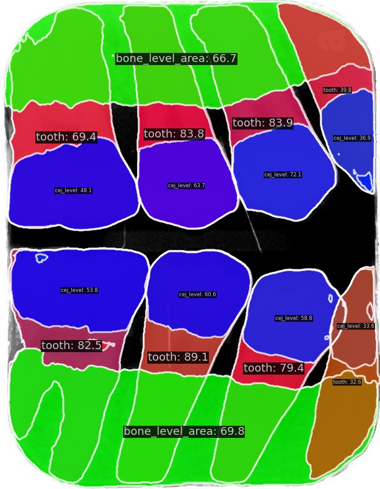
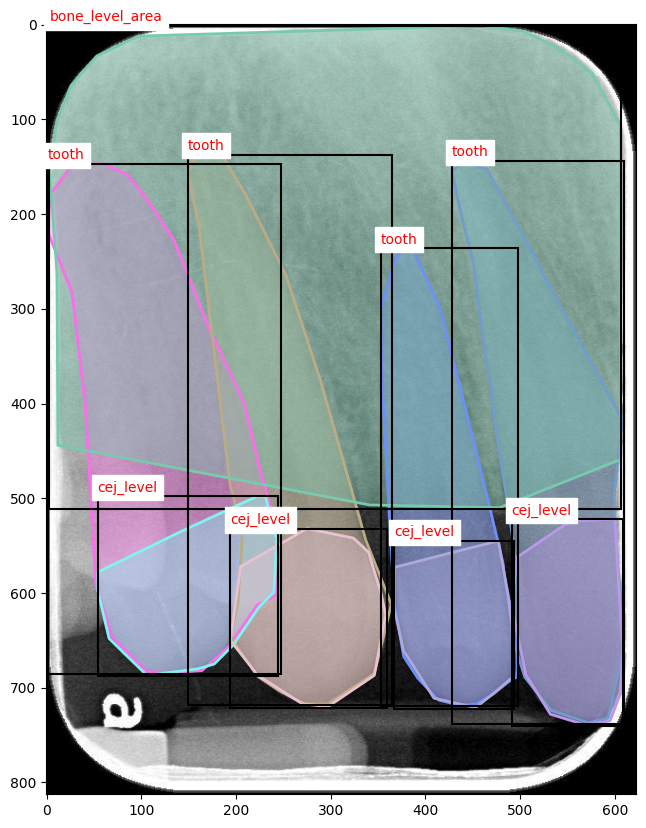

# Periodontal_MMDetection

This project leverages the **MMDetection** framework to perform **instance segmentation** on a custom dataset of **tooth periapical radiographic images**. The primary goal is to generate instance segmentation masks for three specific classes: **tooth**, **bone_level_area**, and **cej_level**. These segmentation masks provide information for identifying key dental structures in medical images.

Below is an example of the input and output images:

### Input Image:
An original periapical radiograph.
<div style="text-align: center;">
    
</div>

### Output Image:
The output image shows the instance segmentation masks for the classes `tooth`, `bone_level_area`, and `cej_level`.

<div style="text-align: center;">
    
</div>

## 1. Environment Setup

### Environment

- **OS**: Ubuntu 22.04.5 LTS (x86_64)
- **GPU**: RTX 4090, Driver version: 550.107.02
- **CUDA Toolkit version**: 12.6
- **Python Version**: 3.10.12
- **PyTorch**: torch==2.4.1+cu124, torchvision==0.19.1+cu124

### Setup Virtual Environment

```bash
python -m venv mmdet_env
source mmdet_env/bin/activate
```

### Install Pytorch

```bash
pip install torch torchvision torchaudio --index-url https://download.pytorch.org/whl/cu124
```

### Install MMEngine and MMCV using MIM

```bash
pip install wheel
pip install -U openmim
mim install mmengine
mim install "mmcv>=2.0.0"
```

### Clone the repository and install MMDetection

```bash
git clone https://github.com/muyishen-dentall-io/Periodontal_MMDetection.git
cd periodontal_mmdet/mmdetection
pip install -v -e .
```

### Verify Installation

```bash
mim download mmdet --config rtmdet_tiny_8xb32-300e_coco --dest .

# Please make sure that the current directory is inside the mmdetection folder
python demo/image_demo.py demo/demo.jpg rtmdet_tiny_8xb32-300e_coco.py --weights rtmdet_tiny_8xb32-300e_coco_20220902_112414-78e30dcc.pth --device cpu
```

## 2. Data and Folder Structure

The project uses a custom dataset in COCO format. Below is the required folder structure:

```
project_root/
│
├── dataset/
|   └── taipei_medical/
|        └── tmu_coco
|           ├── annotations.json
|           ├── train_annotations.json
|           ├── val_annotations.json
|           └── JPEGImages/
|               └── 0.jpg
|               └── 1.jpg
|               └── ...
|
├── custom_configs/
│   ├── tmu_solov2_r50_fpn_1x_coco.py
│   ├── tmu_mask_rcnn_r50_fpn_1x.py
|   ...
│
├── utils
|   ├── train_val_split.py
|   ├── visualize_annotations.py
|   └── inference_result.py
│
├── mmdetection/
...
```

### Train/Validation Splitting Script 

Please note that the train and val annotation JSON files are generated randomly using the provided `utils/train_val_split.py` script from annotations.json. By default, the training set consists of 80% of the data, while the validation set contains the remaining 20%. To use this script, run the following command from your terminal:

``` bash
python utils/train_val_split.py --annotation_file path_to_the_annotation_file 
```

for example:
``` bash
python utils/train_val_split.py --annotation_file /home/muyishen2040/periodontal_mmdet/dataset/taipei_medical/tmu_coco/annotations.json 
```
This will split the dataset and generate the train_annotations.json and val_annotations.json files. The generated train-test split will be saved under the utils folder by default. You can customize the output directory and the train-validation split ratio by adding additional flags. For example:

``` bash
python utils/train_val_split.py --annotation_file /home/muyishen2040/periodontal_mmdet/dataset/taipei_medical/tmu_coco/annotations.json --output_dir /path/to/output --train_ratio 0.9 
```

## 3. Training

### Create or Modify a Configuration File

Before training, you need a configuration file in the `custom_configs` folder. The config file contains the setting of model, dataset, training parameters and so on.

### Navigate to the MMDetection Directory

Once the configuration file is ready, move into the mmdetection directory:

``` bash
# assume the current folder is the project root
cd mmdetection
```

### Run the Training Command

After navigating to the mmdetection directory, you can start training your model using the `tools/train.py` script with your custom configuration file. Here’s the command format:

```bash
python tools/train.py ../custom_configs/your_config_file.py
```

For example:

```bash
python tools/train.py ../custom_configs/tmu_solov2_r50_fpn_1x_coco.py
```

- **Please note that you should change the data path inside the config file before training.**
- **At the bottom of the config, there is a output path setting called `workdir` where the program places the trained models. The checkpoints can be found there.**

## 4. Evaluation

To evaluate the trained model on the validation dataset, run:

``` bash
python tools/test.py ../custom_configs/your_config_file.py path_to_checkpoint.pth
```

- Note that the checkpoint.pth can be found in the `workdir` path listed in the config file.

## 5. Visualization & Model Inference

A simple inference script for trained models is provided in the `utils/inference_result.py` file. The inference script will randomly choose an image from the dataset and inference it. To run the script, use the following command format:

``` bash
python inference_result.py \
    --config_file /path/to/your/your_config_file.py \
    --checkpoint_file /path/to/your/work_dirs/your_model_checkpoint.pth \
    --dataset_dir /path/to/your/dataset/JPEGImages \
    --output_dir ./
```

For example:
``` bash
python inference_result.py \
    --config_file /home/muyishen2040/periodontal_mmdet/custom_configs/tmu_solov2_r50_fpn_1x_coco.py \ 
    --checkpoint_file /home/muyishen2040/periodontal_mmdet/mmdetection/work_dirs/tmu_solov2/epoch_12.pth \
    --dataset_dir /home/muyishen2040/periodontal_mmdet/dataset/taipei_medical/tmu_coco/JPEGImages
```

The output image will be saved in the current directory by default. The following example illustrates the result.

<div style="text-align: center;">
    
</div>

## A. Appendix
The file `utils/visualize_annotations.py` can be used to visualize the ground truth annotations of the dataset.

Example usage:
```
python utils/visualize_annotations.py \
    --data_dir /path/to/your/dataset/tmu_coco \
    --output_path ./annotated_image.png \
    --show_bbox True
```

This command will randomly select an image from the dataset, visualize its annotations, and save the output as annotated_image.png in the current directory. The bounding boxes will be drawn by default.

Example Output Image:
<div style="text-align: center;">
    
