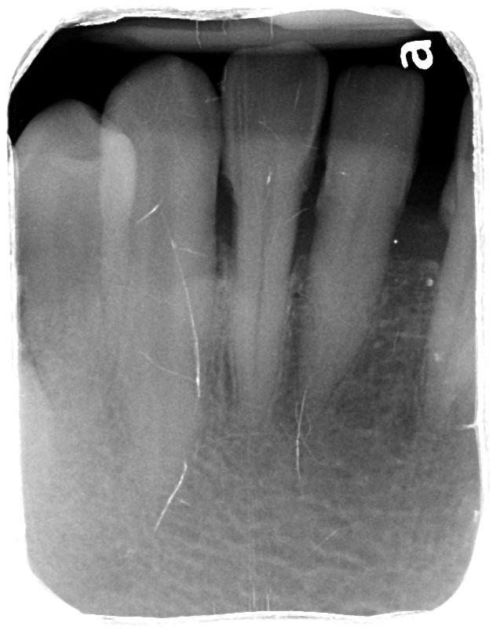
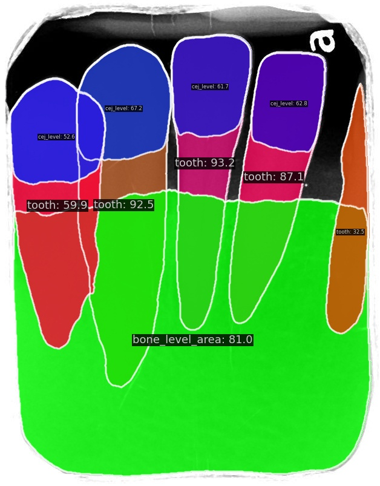

# Periodontal_MMDetection

## 0. Introduction
This project leverages the **MMDetection** framework to perform **instance segmentation** on a custom dataset of **tooth periapical radiographic images**. The primary goal is to generate instance segmentation masks for three specific classes: **tooth**, **bone_level_area**, and **cej_level**. These segmentation masks provide information for identifying key dental structures in medical images.

Below is an example of the input and output images:

### Input Image:
An original periapical radiograph.
<div style="text-align: center;">
    
</div>

### Output Image:
The output image shows the instance segmentation masks for the classes `tooth`, `bone_level_area`, and `cej_level`.

<div style="text-align: center;">
    
</div>

## 1. Environment Setup

### Environment

- **OS**: Ubuntu 22.04.5 LTS (x86_64)
- **GPU**: RTX 4090, Driver version: 550.107.02
- **CUDA Toolkit version**: 12.6
- **Python Version**: 3.10.12
- **PyTorch**: torch==2.4.1+cu124, torchvision==0.19.1+cu124

### Setup Virtual Environment

```bash
python -m venv mmdet_env
source mmdet_env/bin/activate
```

### Install Pytorch

```bash
pip install torch torchvision torchaudio --index-url https://download.pytorch.org/whl/cu124
```

### Install MMEngine and MMCV using MIM

```bash
pip install wheel
pip install -U openmim
mim install mmengine
mim install "mmcv>=2.0.0"
```

### Clone the repository and install MMDetection

```bash
git clone https://github.com/muyishen-dentall-io/Periodontal_MMDetection.git
cd periodontal_mmdet/mmdetection
pip install -v -e .
```

### Verify Installation

```bash
mim download mmdet --config rtmdet_tiny_8xb32-300e_coco --dest .

# Please make sure that the current directory is inside the mmdetection folder
python demo/image_demo.py demo/demo.jpg rtmdet_tiny_8xb32-300e_coco.py --weights rtmdet_tiny_8xb32-300e_coco_20220902_112414-78e30dcc.pth --device cpu
```

## 2. Data and Folder Structure

The project uses a custom dataset in COCO format. Below is the required folder structure:

```
project_root/
│
├── dataset/
|   └── taipei_medical/
|        └── tmu_coco
|           ├── annotations.json
|           ├── train_annotations.json
|           ├── val_annotations.json
|           └── JPEGImages/
|               └── 0.jpg
|               └── 1.jpg
|               └── ...
|
├── custom_configs/
│   ├── tmu_solov2_r50_fpn_1x_coco.py
│   ├── tmu_mask_rcnn_r50_fpn_1x.py
|   ...
│
├── mmdetection/
...
```

- Please note that the train and val annotation JSON files are generated randomly using the provided train_val_div.py script from annotations.json. By default, the training set consists of 80% of the data, while the validation set contains the remaining 20%.

## 3. Training

To start training the model, run the following command:

```bash
python tools/train.py configs/your_config.py
```

## 4. Evaluation

To evaluate the trained model on the validation dataset, run:

```bash
python tools/test.py configs/your_config.py path_to_checkpoint.pth --eval bbox segm
```
